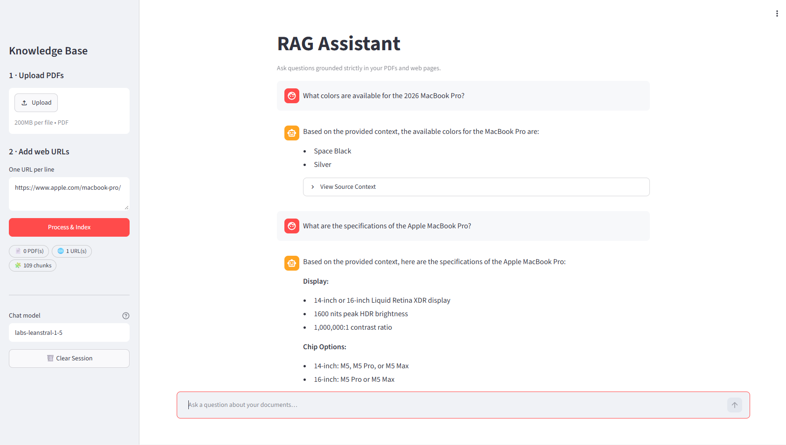

# Generative AI & RAG Assistant 

A comprehensive, hands-on repository for building, understanding, and scaling **Generative AI** and **Retrieval-Augmented Generation (RAG)** systems using **Python**, **LangChain**, **ChromaDB**, and **Mistral AI**.

---

## 🌐 Live Application & Demo

Experience the production-ready interactive RAG Web Application built with Streamlit and deployed on Render.

🔗 **Live App:** [md-aniks.github.io/rag-assistant-ai/](md-aniks.github.io/rag-assistant-ai/)

### 📱 Application Preview


---

##  Features

* **Multi-Source Data Ingestion:** Upload multiple PDF documents or scrape live web content using custom URLs simultaneously.
* **Smart Chunking:** Text processing powered by `RecursiveCharacterTextSplitter` with dynamic chunk size (`1000`) and overlap (`200`).
* **Mistral Embeddings & ChromaDB:** Vector embeddings powered by `mistral-embed` and indexed in ChromaDB.
* **MMR Retrieval:** High-relevance, diverse document extraction using Maximal Marginal Relevance (MMR) search (`k=4`, `fetch_k=10`, `lambda_mult=0.5`).
* **Source Transparency:** Expandable "View Source Context" drawer showing exact chunks and source metadata used for generating answers.
* **Strict Guardrails:** Configured prompt templates ensuring grounded answers derived strictly from ingested documents.

---

##  Complete RAG Architecture Flow

```text
  [ User Query ]
        │
        ▼
 ┌──────────────┐      Vector Search      ┌──────────────┐
 │  Retriever   │ ──────────────────────► │  ChromaDB    │
 └──────────────┘                         └──────────────┘
        │                                         │
        │ Fetches Relevant Chunks                 │
        ▼                                         ▼
┌────────────────────────────────────────────────────────┐
│                   Context + Query                      │
└────────────────────────────────────────────────────────┘
        │
        ▼
 ┌──────────────┐                         ┌──────────────┐
 │ Chat Prompt  │ ──────────────────────► │ ChatMistralAI│ ──► [ AI Response ]
 └──────────────┘                         └──────────────┘